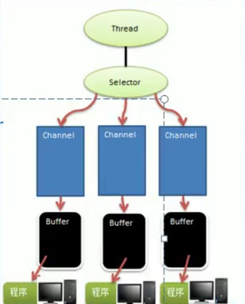

### Selector、Channel、Buffer的关系图

#### 一、 Channel

1. 一个channel都会对应一个Buffer
2. 一个Selector对应一个线程、一个线程对应多个Channel
3. 上图中反映了有三个channel注册到selector上
4. 程序切换到哪个channel是由Event决定的
5. selector可以根据不同的事件在各个channel上切换
6. Buffer本质上就是一个内存块，底层是一个数组
7. 数据的读取或写入是通过buffer实现的，NIO中的buffer可以读取也可以写入，需要使用flip方法切换。
8. Channel是双向的，可以返回底层操作系统的情况。

#### 二、Buffer
1. 缓冲区本质上是一个可以读写数据的内存块，可以理解成是一个容器对象，该对象提供了一组方法可以更轻松地操作内存块。
2. 缓冲区对象内置了一些机制，能够跟踪记录缓冲区的状态变化
3. 缓冲区都有一个共同的父类Buffer类，在父类中有四个属性分别是
    - capacity:缓冲区的最大数据容量，在缓冲区被创建时就确定了并且不可以被修改。
    - limit:缓冲区的当前终点，类似于最大索引位置+1。
    - position:下一个要被度或者写的索引位置，每次度或者写缓冲区都会改变这个位置，为下一次读写做准备。
    - mark:标记
    
#### 三、Channel
1. channel可以同时进行读写数据，可以实现异步读写数据，可以实现从缓冲区读数据，也可以写入数据到缓冲区。
2. Channel常用类有4个：
    - FileChannel: 主要用于文件数据读写
    - ServerChannel/ServerSocketChannel:主要用于TCP数据的读写
    - DatagramChannel:主要用于UDP数据的读写
